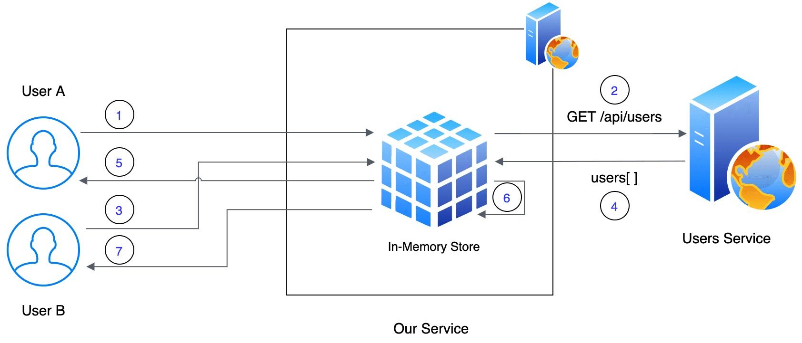

# In-Memory Caching in .NET 9.0 with IMemoryCache
[](https://sahansera.dev)
[](https://github.com/sahansera/InMemoryCacheNetCore/actions/workflows/dotnet.yml)
[](#)
[](https://twitter.com/_SahanSera)

## Intro 👋

This project demonstrates how to implement efficient in-memory caching using IMemoryCache in .NET applications. Originally built for .NET Core and progressively upgraded to .NET 9.0, this implementation showcases modern caching patterns specifically designed for monolithic environments.

For distributed caching approaches, check out my [other project](https://github.com/sahansera/DistributedCacheAspNetCoreRedis) using Redis.

I have also [blogged](https://sahansera.dev/in-memory-caching-aspcore-dotnet/) with a full explanation of the core concepts.

## Project Evolution 📈

This project has evolved through several .NET versions:
- Started with .NET Core 3.1
- Updated to .NET 6 with minimal hosting model
- Recently upgraded to .NET 9.0 with modern C# features

## Key Features in .NET 9.0 Version ✨

- **Modern C# Language Features**: File-scoped namespaces, nullable reference types, and target-typed new expressions
- **Improved Architecture**: Interface-based design following SOLID principles
- **Enhanced HTTP Implementation**: Using modern patterns with `GetFromJsonAsync<T>()` and improved error handling
- **Thread Safety**: Synchronized cache access using SemaphoreSlim
- **Comprehensive Test Suite**: Complete test coverage with xUnit and Moq
- **Decorator Pattern**: Properly implemented DI registration for the caching service

## Architecture 🏗


1. User A makes a request to our web service
2. In-memory cache doesn't have a value in place, it enters into lock state and makes a request to the Users Service
3. User B makes a request to our web service and waits till the lock is released
4. This way, we can reduce the number of calls being made to the external web service. returns the response to our web service and the value is cached
5. Lock is released, User A gets the response
6. User B enters the lock and the cache provides the value (as long it's not expired)
7. User B gets the response

## Project Structure 📁

```
InMemoryCachingSample/             # Main application
  ├── Infrastructure/              # Core infrastructure components
  │   ├── CacheProvider.cs        # IMemoryCache wrapper
  │   └── HttpClient.cs           # HTTP client implementation
  ├── Services/                    # Business logic services
  │   ├── CachedUserService.cs    # Caching decorator for user service
  │   ├── CacheService.cs         # Cache management service
  │   └── UsersService.cs         # User data service
  └── Utils/                       # Utilities
      └── CacheKeys.cs            # Cache key constants

InMemoryCachingSample.Tests/       # Test project
  ├── CachedUserServiceTests.cs   # Tests for caching decorator
  ├── CacheProviderTests.cs       # Tests for cache provider
  ├── CacheServiceTests.cs        # Tests for cache service
  └── HttpClientTests.cs          # Tests for HTTP client
```

## Usage 🚀

### Requirements
- .NET 9.0 SDK or later

### Running the Project
```bash
# Clone the repository
git clone https://github.com/sahansera/InMemoryCacheNetCore.git

# Navigate to the project directory
cd InMemoryCacheNetCore

# Build the project
dotnet build

# Run the application
dotnet run --project InMemoryCachingSample/InMemoryCachingSample.csproj

# Run the tests
dotnet test
```

## Questions? Bugs? Suggestions for Improvement? ❓

Having any issues or troubles getting started? [Get in touch with me](https://sahansera.dev/contact/) 

## Support 🎗

Has this Project helped you learn something new? or helped you at work? Please consider giving a ⭐️ if this project helped you!

## Share it! ❤️

Please share this Repository within your developer community, if you think that this would make a difference! Cheers.

## Contributing ✍️

PRs are welcome! Thank you
